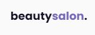
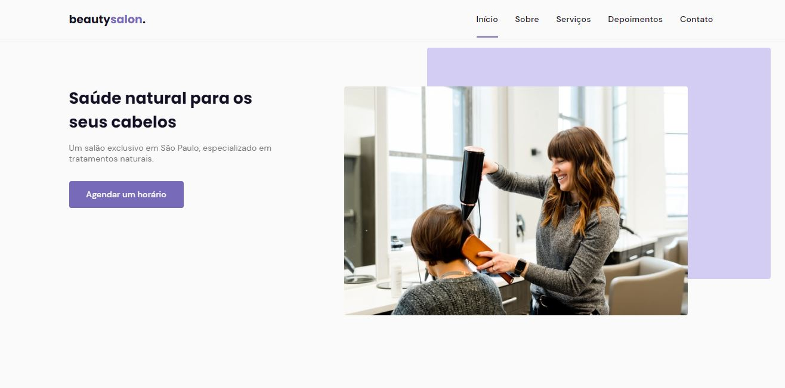
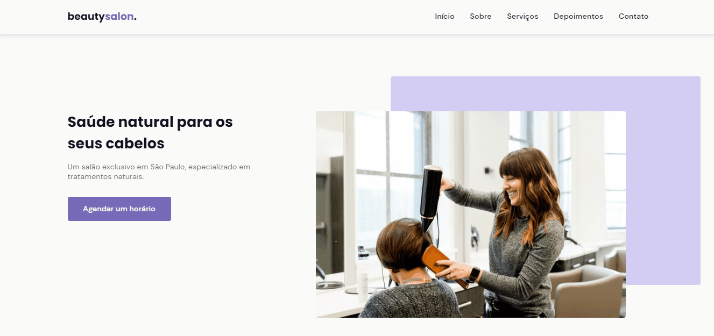
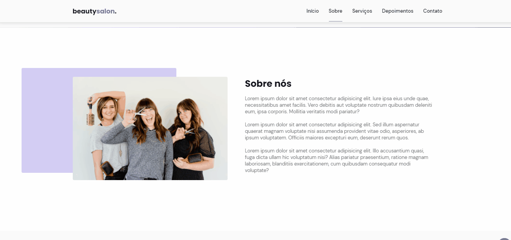
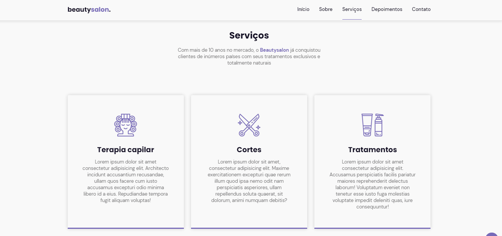
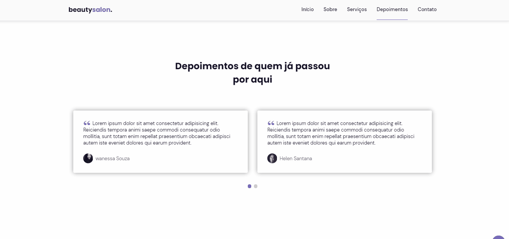

<h1 align="center"> ORIGIN SIX </h1>

 <h1 align="center">
            
</h1>

Projeto desenvolvido na semana nlw da Rocketseat 

<ul>
    

    <a class="title" href="#Home">Início</a> .
    <a class="title" href="#Sobre">Sobre</a> .
    <a class="title" href="#Serviços">Serviços</a> .
    <a class="title"  class="title"href="#Depoimentos"> Depoimentos</a> .
    <a class="title" href="#Contatos">Contato</a> .
    

</ul>

# Home

</h1>

# Sobre

</h1>

# Serviços

</h1>

# Depoimentos

</h1>

# Contatos

</h1>

<h1 align="center">Mobile
</h1>

 

